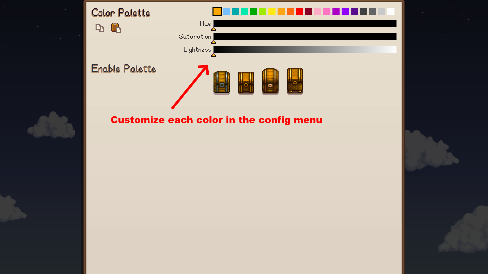
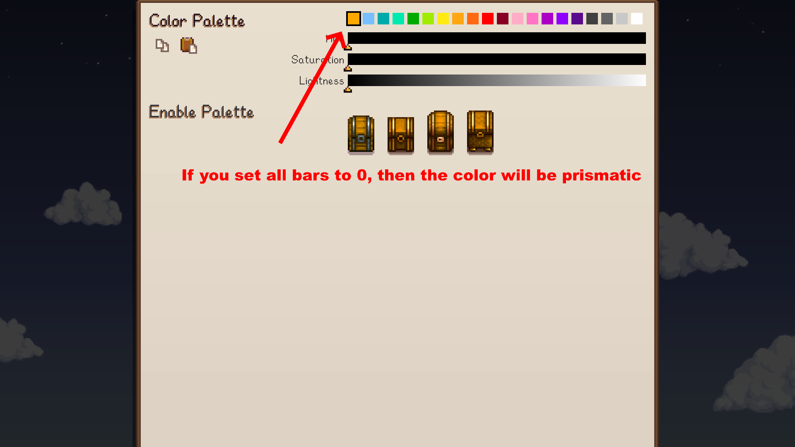

# Colorful Chests

Stardew Valley mod which swaps out the chest color picker palette.

## Contents

- [Colorful Chests](#colorful-chests)
  - [Contents](#contents)
  - [Configurations](#configurations)
  - [Features](#features)
  - [Translations](#translations)

## Configurations

For ease of use, it is recommended to set config options
from [Generic Mod Config Menu](https://www.nexusmods.com/stardewvalley/mods/5098).

## Features

Assign custom colors in the config menu.

You can assign Prismatic as one of the colors.

Your custom colors will be available to choose in the color picker.

## Translations

❌️ = Not Translated, ❔ = Incomplete, ✔️ = Complete

|            |         Carry Chests          |
| :--------- | :---------------------------: |
| Chinese    | [❌️](ColorfulChests/i18n/zh.json) |
| French     | [❔](ColorfulChests/i18n/fr.json) |
| German     | [❌️](ColorfulChests/i18n/de.json) |
| Hungarian  | [❌️](ColorfulChests/i18n/hu.json) |
| Italian    | [❌️](ColorfulChests/i18n/it.json) |
| Japanese   | [❌️](ColorfulChests/i18n/ja.json) |
| Korean     | [❌️](ColorfulChests/i18n/ko.json) |
| Portuguese | [❌️](ColorfulChests/i18n/pt.json) |
| Russian    | [❔](ColorfulChests/i18n/ru.json) |
| Spanish    | [❌️](ColorfulChests/i18n/es.json) |
| Turkish    | [❌️](ColorfulChests/i18n/tr.json) |